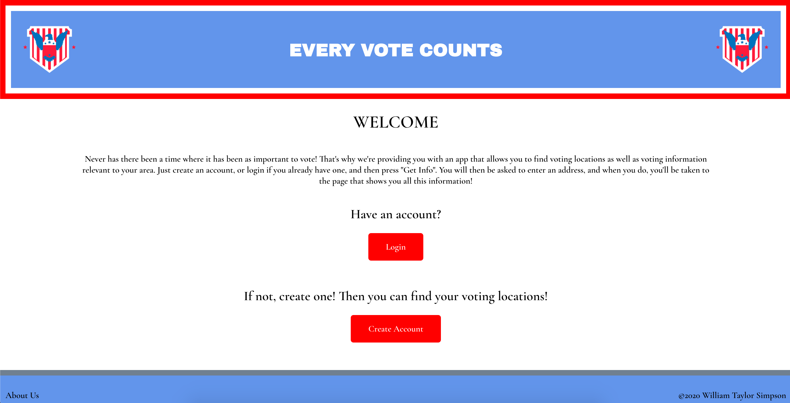
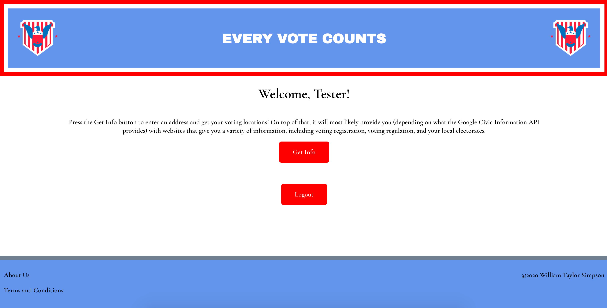
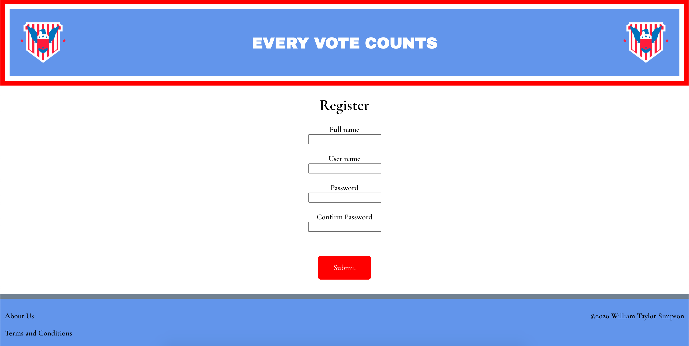
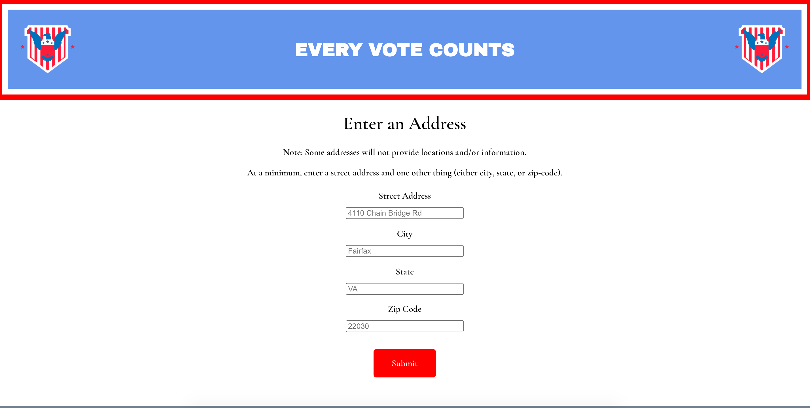
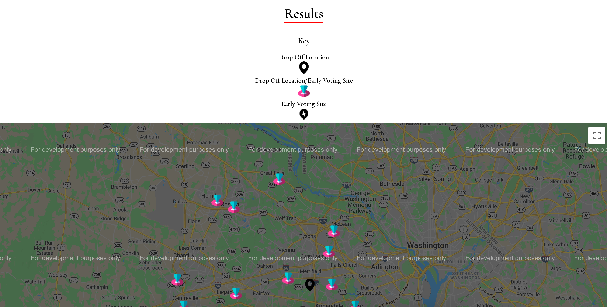
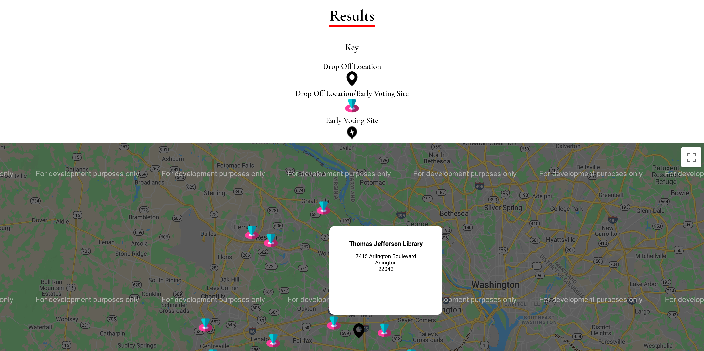
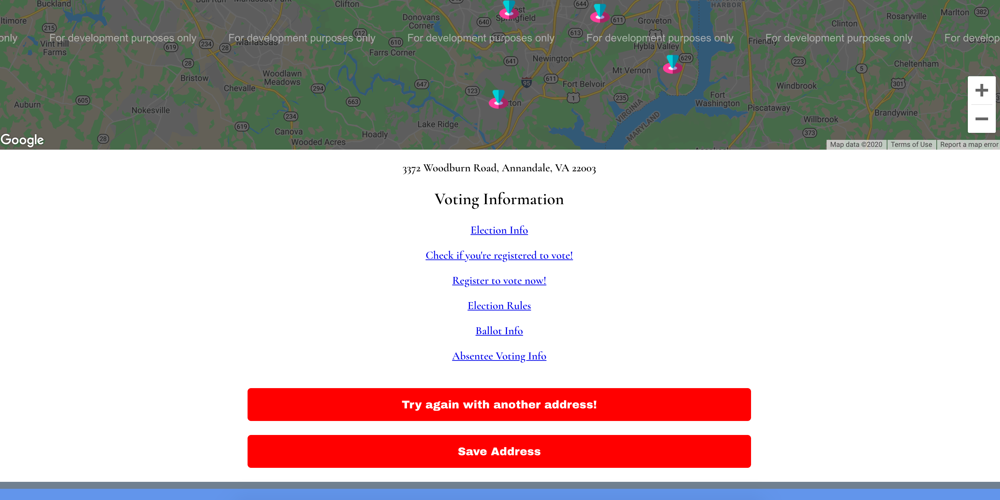

# Every Vote Counts

- Link to app: http://every-vote-counts.vercel.app

## Summary

Every Vote Counts allows you to find voting information near an address you input, as well as other information. In order to do this, you create an account and then log in. If one would like to save an address, one may save up to 5.

## API Documentation

### Auth Router

#### POST /auth/login

```javascript
// req.body
{
    user_name: String,
    password: String,
},

// res.body
[
  {
    authToken: String,
  }
];
```

#### GET /auth/users/:token

```javascript
// req.params
{
    token: String,
},

// res.body
[
  {
    user: Object,
  }
];
```

### Users Router

#### POST /users

```javascript
// req.body
{
    user_name: String,
    full_name: String,
    password: String,
}

// res.body
[
  {
    user: Object,
  }
];
```

#### POST /users/saveaddress

```javascript
// req.body
{
    user_name: String,
    address: String,
},

// res.body
[
  {
    user: Object,
  }
];
```

#### DELETE /users/addresses

```javascript
// req.body

{
    user_name: String,
},

// res.body
[

  {
    user: Object,
  }
];
```

#### DELETE /address

```javascript
// req.body

{
    user_name: String,
},

// res.body
[

  {
    user: Object,
  }
];
```

## Screenshots

- Homepage (not logged in)
  

- Homepage (logged in)
  

- Create Account Page
  

- Get Info Page
  

- Results Page
  

- Location information displayed on results page
  

- Other information displayed on results page
  

- Saved addresses page
  

## Technology

The PERN stack is used for this app.

### Server Side:

The technology used in the server side is Express.js, with a focus on Express.Router(). This facilitates the optimal routing used in this app. PostgreSQL is used to create and manage the database. Postgrator is used to make SQL migrations. Bcrypt, JWT, and XSS are also used for security functionality.
